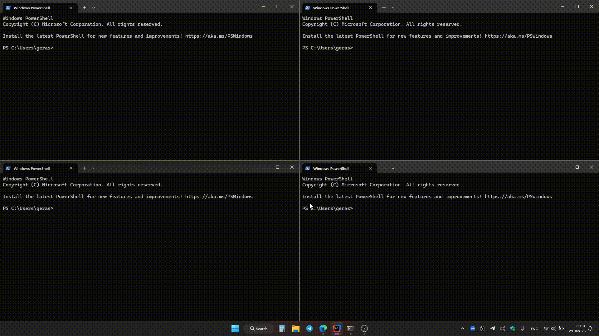

# Multi-Client Server

This project implements a multi-client server capable of handling an unlimited number of simultaneous client connections. It supports private messaging and command handling.

## Features

### Server
- **Unlimited Connections**: The server can handle connections from multiple clients simultaneously.
- **Active Connections Management**: Upon successful connection:
    - The server assigns a randomly generated name to the client (e.g., `client-1`, `client-2`, ..., `client-N`).
    - Connection details, including the assigned name, connection time, and client socket, are stored.
- **Logging**: Logs server starts, each new connection, disconnection, messaging (private and global), errors:  
  `[SERVER] started on port 8000`

  `[SERVER] client-N joined the server`

  `[SERVER] client-N left the server`

  `[SERVER] global message (client-1): message`

  `[SERVER] private message (client-1) -> (client-2) : message`

  `[SERVER] error happened error-message`
- **Command Support**:
    - `exit`: Disconnects the client from the server and removes it from the active connections list.
    - `-p username: message`: Sends a private message to the specified client.
    - `-h`: To write help text.

### Client
- **Server Connection**: Clients can connect to the server.
- **Command Sending**: Clients can send commands, including:
    - Disconnecting from the server using the `exit` command.
    - Sending private messages to other clients using `-p username: message`.

## Example
1. **Usage**


2. **Log Output**: 

```
18:57:46.862 [main] INFO  ua.ithillel.com.net.SocketServer - [SERVER] started on port 8000
18:57:51.630 [Thread-0] INFO  ua.ithillel.com.net.SocketServer - [SERVER] client-1 joined the server
18:57:52.755 [Thread-1] INFO  ua.ithillel.com.net.SocketServer - [SERVER] client-2 joined the server
18:57:53.740 [Thread-2] INFO  ua.ithillel.com.net.SocketServer - [SERVER] client-3 joined the server
18:57:54.762 [Thread-3] INFO  ua.ithillel.com.net.SocketServer - [SERVER] client-4 joined the server
18:57:59.607 [Thread-3] INFO  ua.ithillel.com.net.SocketServer - [SERVER] global message (client-4): Hello everyone
18:58:03.154 [Thread-2] INFO  ua.ithillel.com.net.SocketServer - [SERVER] global message (client-3): yeah
18:58:05.115 [Thread-0] INFO  ua.ithillel.com.net.SocketServer - [SERVER] global message (client-1): hi
18:58:09.576 [Thread-1] INFO  ua.ithillel.com.net.SocketServer - [SERVER] global message (client-2): hello there
18:58:13.287 [Thread-2] INFO  ua.ithillel.com.net.SocketServer - [SERVER] global message (client-3): bye
18:58:15.352 [Thread-2] INFO  ua.ithillel.com.net.SocketServer - [SERVER] client-3 left the server
18:58:31.091 [Thread-0] INFO  ua.ithillel.com.net.SocketServer - [SERVER] private message (client-1) -> (client-2) : do u hear me?
18:58:47.415 [Thread-1] INFO  ua.ithillel.com.net.SocketServer - [SERVER] private message (client-2) -> (client-1) : Yes. It` private chat
18:58:55.995 [Thread-3] INFO  ua.ithillel.com.net.SocketServer - [SERVER] global message (client-4): are you still here?
18:58:57.739 [Thread-3] INFO  ua.ithillel.com.net.SocketServer - [SERVER] global message (client-4): ///
18:58:59.285 [Thread-3] INFO  ua.ithillel.com.net.SocketServer - [SERVER] client-4 left the server
18:59:03.793 [Thread-0] INFO  ua.ithillel.com.net.SocketServer - [SERVER] client-1 left the server
18:59:07.713 [Thread-1] INFO  ua.ithillel.com.net.SocketServer - [SERVER] global message (client-2): ...
18:59:10.433 [Thread-1] INFO  ua.ithillel.com.net.SocketServer - [SERVER] client-2 left the server

```